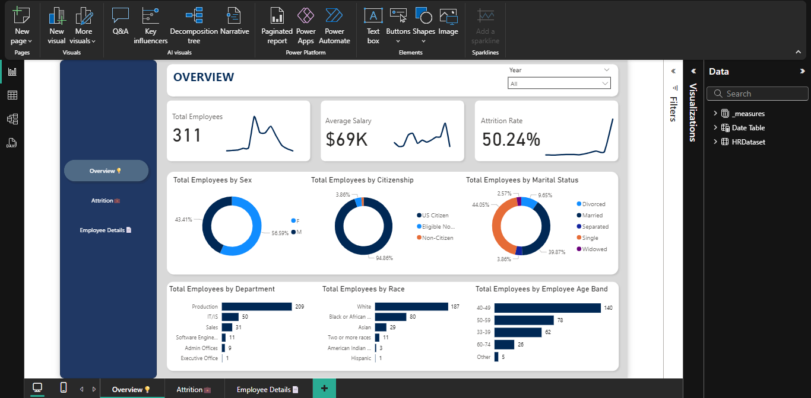
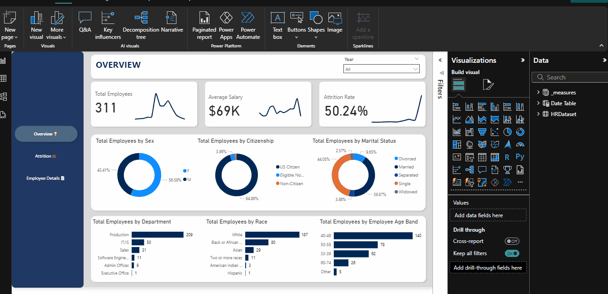

# 📊 HR Attrition Analytics – Executive Summary

## 🏢 Project Overview
This project analyzes **workforce attrition** to identify high-risk employee groups, understand workforce composition, and provide actionable insights for retention strategies. The dashboard was built using **Power BI**, transforming raw HR data into trends, KPIs, and recommendations for strategic decision-making.

---

## 📌 Workforce Snapshot

| Metric | Value |
|--------|-------|
| Total Employees | 311 |
| Average Salary | $69,000 |
| Attrition Rate | 50.24% |
| Gender | 43% Male, 57% Female |
| US Citizenship | 94.86% |
| Department Breakdown | Production: 209, IT: 50, Sales: 31, Executive: 1, Admin: 9 |
| Race | White: 189, African/Black: 80, Asian: 29 |
| Age Groups | 40–49: 140, 50–59: 78, 33–39: 62, 60–74: 26 |

---

## 🔍 Key Insights

### 1. Attrition Risk
- **Attrition Rate: 50.24%** — extremely high; half the workforce is leaving.  
- Attrition is likely concentrated in **high-volume departments** such as Production (209 employees) and Sales (31 employees).  

**Insight:** Operational roles may be under pressure, leading to turnover. This could disrupt production efficiency and customer delivery.

---

### 2. Workforce Demographics
- **Gender:** More females (57%) than males (43%), may affect role-specific retention strategies.  
- **Age:** Largest cohorts are 40–49 (140 employees) and 50–59 (78 employees), indicating mid-to-late career employees dominate the workforce.  
- **Race:** Majority White (189), followed by African/Black (80), then Asian (29).  

**Insight:** Any retention interventions should consider **age-specific motivations** and **inclusive engagement programs**.

---

### 3. Departmental Concentration
- Production dominates (209 employees, ~67% of workforce)  
- IT (50) and Sales (31) are mid-sized, Executive (1) and Admin Offices (9) are very small

**Insight:** Retention in Production is critical for operational continuity. IT and Sales may need targeted programs to prevent knowledge loss and client impact.

---

### 4. Geographic Focus
- **US employees:** 94.86% of workforce  
- Suggests **HR policies and engagement programs should be US-centric**, but consider minority inclusion and local compliance.

---

### 5. Financial Implications
- Average salary $69k × high attrition → **significant cost to replace employees**  
- High attrition likely results in **training, recruitment, and productivity loss costs**.

**Insight:** Reducing attrition in high-volume departments could save substantial money annually.

---

## 💡 Recommendations

1. **Targeted Retention Programs**
   - Focus on **Production, Sales, and mid-career employees (ages 40–59)**
   - Provide career development, recognition programs, and work-life balance incentives

2. **Early Warning & Predictive Analytics**
   - Monitor attrition trends using department, tenure, and demographic KPIs  
   - Flag high-risk employees proactively for engagement or mentorship

3. **Inclusive Engagement**
   - Develop programs that address **diverse workforce needs** by gender, age, and race  
   - Encourage inclusion in decision-making, training, and recognition

4. **Financial Planning**
   - Calculate **attrition cost per department** to prioritize retention investments  
   - Align HR budget to support high-impact retention initiatives

5. **Executive Oversight**
   - Quarterly reviews of attrition trends with leadership  
   - Set measurable goals to reduce attrition below 30% within the next fiscal year

---

## 🚀 Conclusion
The HR attrition analytics dashboard provides a **clear view of workforce risk and composition**, highlighting high-risk departments and employee segments. By implementing **targeted retention programs, predictive monitoring, and inclusive engagement**, the organization can reduce attrition, retain critical talent, and minimize financial impact.

